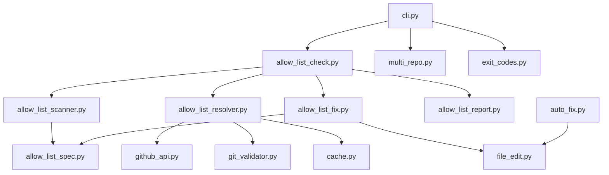

<!--
SPDX-License-Identifier: Apache-2.0
SPDX-FileCopyrightText: 2026 The Linux Foundation
-->

# Allow-List Pin Detection and Remediation

Design and implementation plan for detecting (and optionally bumping)
stale `harden-runner-block-action` allow-list pins in
`gha-workflow-linter`.

Tracking issues:

- [`lfreleng-actions/gha-workflow-linter#296`][issue-296] — detect stale
  harden-runner allow-list pins
- [`lfreleng-actions/.github#146`][issue-146] — scheduled tool/workflow
  to bump allow-list pins automatically, with Slack notification

[issue-296]: https://github.com/lfreleng-actions/gha-workflow-linter/issues/296
[issue-146]: https://github.com/lfreleng-actions/.github/issues/146

## Table of contents

1. [Problem statement](#1-problem-statement)
2. [The reference format we must understand](#2-the-reference-format-we-must-understand)
3. [What exists in the linter today](#3-what-exists-in-the-linter-today)
4. [Design principles](#4-design-principles)
5. [Detection design](#5-detection-design)
6. [Resolution design](#6-resolution-design)
7. [Finding model, severity and suppression](#7-finding-model-severity-and-suppression)
8. [Error handling, issue taxonomy and exit codes](#8-error-handling-issue-taxonomy-and-exit-codes)
9. [CLI surface](#9-cli-surface)
10. [Remediation design](#10-remediation-design)
11. [Multi-repository mode](#11-multi-repository-mode)
12. [Module layout](#12-module-layout)
13. [Shared/centralised helpers](#13-sharedcentralised-helpers)
14. [Configuration file surface](#14-configuration-file-surface)
15. [Scheduled workflow and Slack notification](#15-scheduled-workflow-and-slack-notification)
16. [Test plan](#16-test-plan)
17. [Documentation changes](#17-documentation-changes)
18. [Delivery phases](#18-delivery-phases)
19. [Risks, edge cases and open questions](#19-risks-edge-cases-and-open-questions)

---

## 1. Problem statement

The `lfreleng-actions` workflow-repository family pins the
`step-security/harden-runner` egress allow-list using a custom,
`uses:`-style coordinate consumed by
`lfreleng-actions/harden-runner-block-action`. Because these are values
of `config:` / `default:` keys and **not** `uses:` references,
Dependabot cannot see them, and neither can the linter today.

Two pin shapes appear in the estate:

<!-- markdownlint-disable MD013 -->

```yaml
# 1. Reusable-workflow input default (explicit path form)
on:
  workflow_call:
    inputs:
      harden_runner_allowlist:
        type: string
        # yamllint disable-line rule:line-length
        default: 'lfreleng-actions//.github/harden-runner/lfreleng-actions/allow_list.txt@bf6642f68d58c1b81bbe993e676d6cc339ac3654'  # v0.12.2

# 2. Internal workflow step (shorthand form)
steps:
  - uses: lfreleng-actions/harden-runner-block-action@6db537b3...  # v0.2.1
    with:
      config: '@18d9c4446bea555d0783e850f6d295f844fe8f67'  # v0.1.1
```

<!-- markdownlint-enable MD013 -->

Drift is real and severe. A sweep on 2026-07-31 found reusable-workflow
defaults spread across v0.4.1 → v0.12.1, while the internal
`tag-push` / `release-drafter` / `clear-action-cache` workflows were
stuck at **v0.1.1** in most repositories. Verified against the local
`.github` checkout at the time of writing:

<!-- markdownlint-disable MD013 -->

<!-- markdownlint-disable MD013 MD060 -->

| Pinned SHA                                 | Tag       | Where seen                                                                     | Latest `.github` tag |
| ------------------------------------------ | --------- | ------------------------------------------------------------------------------ | -------------------- |
| `bf6642f68d58c1b81bbe993e676d6cc339ac3654` | `v0.12.2` | `java-workflows` reusable defaults                                             | `v0.12.2` ✅         |
| `8f4f0cf83e6a015957e83261ed379fd811fc060e` | `v0.5.1`  | `.github` aislop/repo-discovery workflows                                      | `v0.12.2` ❌         |
| `18d9c4446bea555d0783e850f6d295f844fe8f67` | `v0.1.1`  | `.github` zizmor/tag-push/release-drafter, `java-workflows` internal workflows | `v0.12.2` ❌         |

<!-- markdownlint-enable MD013 MD060 -->

<!-- markdownlint-enable MD013 -->

A stale pin does not fail loudly. It silently omits newly allow-listed
endpoints, so block-mode jobs fail much later with confusing
`ECONNREFUSED` errors against hosts that were fixed in the allow-list
weeks earlier.

### 1.1 Not all staleness matters equally

The `.github` repository is, ironically, the most stale repository in the
estate — the repository that *publishes* the allow-list carries the
oldest pins. That is a curiosity rather than an emergency, and the design
treats it as such.

The impact of a stale pin depends entirely on what the workflow *does*:

<!-- markdownlint-disable MD013 -->

| Tier         | Repositories               | Why staleness matters                                                                                                                                                                                   | Sweep behaviour           |
| ------------ | -------------------------- | ------------------------------------------------------------------------------------------------------------------------------------------------------------------------------------------------------- | ------------------------- |
| **Critical** | `*-workflows`              | These host the reusable build workflows consumers actually run. Builds reach package registries, artifact stores and scanner backends, so a missing endpoint breaks real builds in downstream projects. | PRs raised, Slack digest  |
| **Advisory** | `.github`, everything else | Standard GitHub plumbing (labelling, tagging, release drafting, SARIF upload) touches a small, stable endpoint set. A pin several versions behind has little or no practical effect.                    | Reported only; PRs opt-in |

<!-- markdownlint-enable MD013 -->

This tiering is a **policy** concern, not a tool concern. The linter stays
neutral — it reports what it finds, wherever it runs — and the tiering
lives in the scheduled sweep's scope configuration (§15). Two consequences
follow, and both are load-bearing for the rest of this design:

1. The default advisory (warning-only) posture is clearly correct. Most
   detections are genuinely not urgent, and a linter that blocks commits
   over a non-urgent policy will be switched off.
2. Suppression must be a first-class, supported mechanism (§7.4), not an
   afterthought. Deliberately lagging pins are a legitimate and expected
   state, especially outside the critical tier.

## 2. The reference format we must understand

The grammar is defined by `resolve_config_source.py`, a file mirrored
byte-for-byte between `harden-runner-block-action` and
`python-audit-action`. We must **mirror its parsing semantics exactly**;
divergence produces false positives on valid pins.

```text
<config> ::= <source> [ "@" <ref> ] [ <ws>+ "#" <comment> ]
<source> ::= [ <host-org> [ "/" <repo> ] ] [ "//" <subpath> ]
```

Defaults applied to omitted elements:

<!-- markdownlint-disable MD013 -->

| Element   | Default                                                              |
| --------- | -------------------------------------------------------------------- |
| host-org  | `github.repository_owner` (the *workflow* org)                       |
| repo      | `.github`                                                            |
| directory | `.github/<family>/<workflow-org>/` then `.github/<family>/`          |
| filename  | `allow_list.txt`                                                     |
| ref       | the host repo's default branch (`HEAD`)                              |

<!-- markdownlint-enable MD013 -->

`<family>` is `harden-runner` for `harden-runner-block-action`.

Behaviours the parser must reproduce:

- **`//` separates repo from in-repo path** (go-getter/Terraform
  convention). Text after `//` that is empty, or a bare filename with no
  `/`, keeps the two-candidate directory search chain; text containing a
  `/` is an explicit path with no search.
- **Comment splitting** — a `#` preceded by at least one space or tab
  starts a trailing comment. `foo#bar` is a single token, *not* a
  comment. This matters: the version comment is the secondary signal we
  cross-check against, and mis-splitting it corrupts the pin.
- **Shorthand `@<sha>`** — an empty source means "the workflow org's
  `.github` repo, default search chain, `allow_list.txt`". This is the
  form used by every internal workflow, and it is the form that drifted
  the furthest.
- **At most one `@` and at most one `//`**; violations are errors.
- **Validation** of org (`ORG_RE`), repo (`REPO_RE`), ref (`REF_RE`, no
  leading `-` or `/`, no `..`, no `@{`, ≤ 255 chars) and each path
  segment (`SEGMENT_RE`, no empty segments, no `..`).

### Annotated tags matter

`.github` releases use **annotated** tags, and the pins carry the
**commit** SHA, not the tag-object SHA. Confirmed locally:

```console
$ git rev-parse v0.12.2            # tag object
8f363565e79650362c3359ee23b6d6fd295866ee
$ git rev-parse v0.12.2^{commit}   # what the pins actually contain
bf6642f68d58c1b81bbe993e676d6cc339ac3654
```

Any comparison must peel to the commit. Comparing against the tag object
SHA would flag every correctly-pinned reference as stale.

### Two comment positions

The version comment can sit in either of two places, and the design must
handle both:

```yaml
# A. YAML comment — the '#' is OUTSIDE the quotes.
#    The action never sees it; YAML discards it before the value is read.
config: '@8f4f0cf83e6a015957e83261ed379fd811fc060e'  # v0.5.1

# B. In-scalar comment — the '#' is INSIDE the quotes.
#    Part of the scalar; the action's own split_comment() strips it.
config: '@8f4f0cf83e6a015957e83261ed379fd811fc060e # v0.5.1'
```

Form B is why `split_comment` exists in the action at all, and the action
README documents it (`lfit@ab7a940… # v1.0.0`). Across the current estate,
however, **every one of the 20 pins uses form A**; form B appears only in
documentation. The implementation supports both and must preserve
whichever form it finds, but form A is the case to optimise for and the
one the fixture suite should weight most heavily.

This distinction matters again for suppression directives (§7.4), which
are recognised in the *effective* trailing comment regardless of which
side of the quote it falls on.

### Values we must *not* treat as pins

- `config: ${{ inputs.harden_runner_allowlist }}` — a GitHub expression,
  resolved at run time. Not a pin; skip silently.
- `config: 'lfreleng-actions@main'` — a branch ref. Not stale by SHA
  comparison, but *unpinned*; reported under a separate finding kind.

## 3. What exists in the linter today

Relevant facts established by auditing the codebase:

- **CLI** is Typer, with subcommands `lint` and `cache`, plus argv
  preprocessing (`_preprocess_args_for_default_command`) that injects
  `lint` when no subcommand is given. Any new value-taking option must be
  added to the `value_taking_options` set in that function.
- **Exit codes** are only `0` and `1`, decided in `_determine_exit_code`.
  There is no central definition; `typer.Exit(1)` literals are scattered
  through `cli.py`. Click reserves `2` for usage errors.
- **Config** is `models.Config` (pydantic v2), loaded from YAML by
  `config.ConfigManager`. CLI overrides use a tri-state (`None` = not
  specified) in `models.CLIOptions`, merged by `_apply_cli_overrides`.
- **Scanning** is regex-per-line (`patterns.ActionCallPatterns`) over
  files found by `scanner.WorkflowScanner`. `scanner._is_valid_yaml`
  already parses each file with `yaml.safe_load` and **throws the result
  away** — a free hook for structural detection.
- **No severity model exists.** `ValidationResult` conflates outcome and
  issue kind; every non-`VALID` result is an error.
- **No tag → commit SHA resolution exists** in either backend.
  `github_api.py` only asks "does this ref exist?" and discards the OID.
  `git_validator._get_remote_tags` runs `git ls-remote --tags`, already
  handles the `^{}` peel suffix, and then **discards the SHA column**.
- **`cache.ValidationCache` already has `get_latest_version` /
  `put_latest_version`** storing `(latest_tag, latest_sha)` per
  repository with TTL — the exact storage shape we need.
- **Auto-fix rewrites files** via `AutoFixer._apply_fixes_to_file`:
  read all lines, replace by 1-based index, write back. It is
  non-atomic, has no backup, and hard-codes `\n`.
- **`--auto-latest`** gates `check_for_updates`, which distinguishes
  "fix validation errors" from "bump to newest release".

## 4. Design principles

1. **Never break the pre-commit contract.** The linter runs as a
   pre-commit hook. Allow-list checking is an `lfreleng-actions`-specific
   policy, not GitHub-native validation, so by default it is
   **advisory**: it reports and never changes the exit code.
2. **Opt-in enforcement.** `--verify-allow-list` promotes advisory
   findings to errors with a dedicated, documented exit code.
3. **Fail open on infrastructure problems.** No token, no network, rate
   limited, unresolvable release → warn and skip. A developer offline on
   a train must still be able to commit.
4. **Mirror the canonical grammar, do not reinvent it.** The spec parser
   is a faithful port of `resolve_config_source.py` with a test suite
   derived from that action's own cases.
5. **Reuse before adding.** Latest-release resolution, caching, token
   discovery, file discovery and line rewriting all have existing homes.
   Extend them rather than growing a parallel stack.
6. **Structural detection, line-accurate edits.** Identify pins from the
   YAML node tree (precision); rewrite by line and column (formatting
   preservation).
7. **Treat every consumer identically.** The central repository hosts one
   allow-list directory per consumer family, side by side, by design. The
   linter special-cases none of them and needs to know about none of
   them (§5.4).

## 5. Detection design

### 5.1 Two-stage: structural identification, lexical edit

PyYAML's `yaml.compose()` produces a node tree whose scalar nodes carry
`start_mark` / `end_mark` (line and column). This needs no new
dependency and gives us both precision *and* exact source positions.

Stage 1 — **structural identification** (`allow_list_scanner.py`):

Walk the composed node tree of each workflow / action file and collect
candidate scalars from three known locations:

<!-- markdownlint-disable MD013 -->

| #   | Location                                                                                   | Example                                                  |
| --- | ------------------------------------------------------------------------------------------ | -------------------------------------------------------- |
| 1   | `jobs.<job>.steps[*].with.config` — the shared resolver's input is always named `config`   | `config: '@18d9c444…'`                                   |
| 2   | `on.workflow_call.inputs.<name>.default` where the value parses as a valid spec            | `default: 'lfreleng-actions//…/allow_list.txt@bf6642f…'` |
| 3   | `jobs.<job>.with.<name>` (reusable-workflow caller) where the value parses as a valid spec | `harden_runner_allowlist: '…@bf6642f…'`                  |

<!-- markdownlint-enable MD013 -->

**There is no per-consumer registry.** Detection is anchored on the
*syntax* — an input named `config`, or a scalar that parses as a valid
config spec — never on which action happens to consume it. See §5.4.

**Recogniser predicate** for locations 2 and 3 (where the key name is
arbitrary) — the scalar qualifies when it parses as a valid spec **and**
either:

- the resolved candidate path ends in the conventional allow-list
  filename (`allow_list.txt`), or
- the key name matches a configurable pattern list, default
  `["*allow_list*", "*allowlist*", "*allow-list*"]`.

This is a documented, deterministic rule rather than a heuristic, and it
is deliberately conservative: an unrecognised scalar is simply not a pin.

> **YAML gotcha:** PyYAML resolves the bare key `on` to boolean `True`
> under YAML 1.1. The walker must accept both `"on"` and `True` as the
> trigger-block key. This is a classic source of silent misses.

Stage 2 — **lexical extraction and edit anchoring**: for each candidate
scalar node, record `start_mark.line` (0-based → 1-based line number),
`start_mark.column`, `end_mark`, the raw source line, the quoting style
(inferred from the source text at that column), and the trailing
`# vX.Y.Z` comment recovered from the raw line by the same
`split_comment` rule the action uses.

If `start_mark.line != end_mark.line`, the scalar spans multiple lines
(block scalar or wrapped flow scalar). Record the pin, report it, but
mark it `auto_fixable=False` — we will not attempt a multi-line rewrite.

### 5.2 Skip rules

Skip (no finding, debug log only) when the scalar:

- contains `${{` — a GitHub expression, resolved at run time;
- fails to parse under the spec grammar **and** the recogniser only
  matched on key name (avoids noisy findings on unrelated inputs);
- resolves to a host repo the run cannot resolve (see §6.4).

### 5.3 File discovery

Reuse `WorkflowScanner.find_workflow_files()` unchanged — it already
covers `.github/workflows/*.y{a,}ml` at any depth plus `action.y{a,}ml`,
honours `scan_extensions`, `exclude_patterns`, `skip_actions` and
`--files`. Issue #296 mentions `examples/`; example caller workflows
under `examples/` that are *not* inside a `.github/workflows` directory
are not currently discovered. Add an opt-in
`allow_list.extra_globs` config key (default
`["examples/**/*.yaml", "examples/**/*.yml"]`, applied **only** to the
allow-list checker) so the existing action-call scan behaviour is not
changed.

### 5.4 Consumers are not special-cased

The central repository's layout was designed from the outset to host any
number of allow-lists side by side, one directory per consumer family:

```text
.github/harden-runner/<org>/allow_list.txt   # egress endpoints
.github/python-audit/<org>/allow_list.txt    # vulnerability IDs
.github/<future-family>/<org>/allow_list.txt
```

The families are **data**, not code. Every consumer shares one grammar,
one resolver (`resolve_config_source.py`, mirrored byte-for-byte between
the consuming actions), one host repository (`<org>/.github`) and one
convention for the input name (`config`). The only per-consumer
difference is a `--family` flag chosen by the action at run time, which
selects a directory.

The linter therefore needs **no knowledge of any consumer at all**:

- **Staleness is family-independent.** A pin is stale when its ref is not
  the latest release commit of the host repository. That comparison never
  touches the in-repo path, so the family cannot affect the verdict.
- **The family is needed only for display.** It is read out of the
  resolved path when one is present, purely so reports can say which
  allow-list a pin refers to. Nothing branches on it.
- **New consumers are free.** `node-audit-action` (whose README states it
  mirrors `python-audit-action`) and anything after it are covered on the
  day they appear, with no code change, no registry entry and no release.

This is why the earlier sketch of a "known consumer actions registry"
with per-action family/filename mappings has been removed: it would have
re-encoded, as special cases in the linter, a distinction the central
design deliberately keeps out of the mechanism. Treating consumers
uniformly is both simpler and more faithful to the model.

One consequence worth stating plainly: because detection keys on syntax
rather than on a consumer allow-list, an unrecognised or brand-new
consumer is handled correctly by default, and the failure mode for an
unrelated `config:` value is a skip (§5.2), not a false finding.

## 6. Resolution design

### 6.1 What "latest" means

For each distinct resolved `host_org/repo` across all detected pins,
resolve the **latest release** and peel its annotated tag to a commit:

```text
latest release tag  →  refs/tags/<tag>  →  peel to commit  →  target SHA
```

Preference order, mirroring the existing `auto_fix_versions` logic:

1. `latestRelease` (excluding drafts; excluding prereleases unless
   `allow_prerelease`), when its tag matches `VERSION_TAG_PATTERN`.
2. Newest tag by `(_get_version_specificity, _parse_version)` descending.
3. Give up → resolution failure (§6.4).

`--cooldown` / `cooldown_days` is honoured, reusing
`version_utils._select_version_with_cooldown`, so an allow-list bump
obeys the same supply-chain quarantine as an action bump.

### 6.2 Backends

Both existing backends are extended rather than bypassed:

**GitHub API** (`github_api.py`) — add one batched GraphQL method:

```python
async def resolve_latest_releases_batch(
    self, repo_keys: list[str]
) -> dict[str, LatestRelease | None]:
    """Resolve each repo's latest release tag and peeled commit SHA."""
```

The query selects `latestRelease { tagName, publishedAt }` and
`refs(refPrefix: "refs/tags/", first: 100, orderBy: {field: TAG_COMMIT_DATE,
direction: DESC})` with
`target { oid ... on Tag { target { oid } } }`, so annotated tags peel in
a single round trip. `_extract_sha_from_ref_data` in
`auto_fix_resolution.py` already implements exactly this peel and is
reused verbatim.

**Git** (`git_validator.py`) — add:

```python
def _get_remote_tag_shas(url: str, config: GitConfig) -> dict[str, str]:
    """Map tag name -> commit SHA, preferring the peeled ``^{}`` line."""
```

This is a small, high-value change: `_get_remote_tags` already parses the
`^{}` suffix and then throws the SHA away. Preserving both columns gives
token-free tag listing *and* annotated-tag peeling. The git backend
cannot supply release dates, so — consistent with the existing
`_get_latest_version_via_git` behaviour — it returns `None` when
`cooldown_days > 0` rather than guessing.

### 6.3 Determining the workflow org

The shorthand `@<sha>` resolves `host_org` from the *workflow* org,
which at lint time we must infer. Precedence:

1. `--allow-list-org` CLI flag (explicit).
2. `allow_list.org` config key.
3. `GITHUB_REPOSITORY_OWNER` environment variable (set in Actions).
4. Owner parsed from the `upstream` git remote of the scanned repository.
5. Owner parsed from the `origin` git remote.
6. Unresolvable → skip shorthand pins with a warning (§6.4).

Preferring `upstream` over `origin` is deliberate: LF contributors work
from personal forks (`origin` = `modeseven-lfreleng-actions/...`,
`upstream` = `lfreleng-actions/...`), and the pins are meant to track the
upstream org's `.github` repository. A fork owner would resolve to a
`.github` repo that does not exist.

In multi-repository mode (§11) this is resolved **per repository**.

### 6.4 Failure handling

Resolution failure (no token and no network, rate limited, repository
not found, no releases, cooldown excludes everything):

- **Default mode** — emit a single consolidated notice
  (`Allow-list check skipped: <reason>`), record nothing, do not change
  the exit code.
- **`--verify-allow-list`** — exit code `4` (§8). Enforcement that
  silently degrades to "pass" is worse than useless in CI.

Successful resolutions are written to `ValidationCache` via the existing
`put_latest_version` / `get_latest_version` pair, so a repeated
pre-commit run costs zero API calls within the TTL.

## 7. Finding model, severity and suppression

### 7.1 Introducing severity

The codebase has no severity concept. Rather than retrofit severity onto
`ValidationResult` (which would ripple through the validator, the summary
counters and the JSON schema), introduce it **alongside**, scoped to the
new subsystem, with a shared enum that the existing subsystem can adopt
later:

```python
class Severity(str, Enum):
    """Reporting severity for a linter finding."""

    ERROR = "error"      # fails the run (subject to mode/flags)
    WARNING = "warning"  # reported, never fails the run
    NOTICE = "notice"    # informational only
```

### 7.2 Finding kinds

```python
class AllowListFindingKind(str, Enum):
    STALE = "stale"                        # SHA != latest release commit
    COMMENT_MISMATCH = "comment_mismatch"  # trailing # vX.Y.Z lies
    UNPINNED = "unpinned"                  # ref is a branch/tag, not a SHA
    UNRESOLVABLE = "unresolvable"          # SHA not present in host repo
    INVALID_SPEC = "invalid_spec"          # fails the config grammar
```

Default severities, and behaviour under each flag:

<!-- markdownlint-disable MD013 -->

<!-- markdownlint-disable MD013 MD060 -->

| Kind               | Default   | `--verify-allow-list`                  | Auto-fixable by `--update-allow-list` |
| ------------------ | --------- | -------------------------------------- | ------------------------------------- |
| `STALE`            | `WARNING` | `ERROR`                                | ✅                                    |
| `COMMENT_MISMATCH` | `WARNING` | `ERROR`                                | ✅ (rewrites the comment)             |
| `UNPINNED`         | `NOTICE`  | `ERROR` only when `require_pinned_sha` | ✅ (pins to latest release commit)    |
| `UNRESOLVABLE`     | `WARNING` | `ERROR`                                | ✅ (repins to latest release commit)  |
| `INVALID_SPEC`     | `ERROR`   | `ERROR`                                | ❌ (needs human judgement)            |

<!-- markdownlint-enable MD013 MD060 -->

<!-- markdownlint-enable MD013 -->

`INVALID_SPEC` is an error even by default because it is a *local*
correctness problem with no network dependency: the action will fail at
run time. It is exactly the kind of thing a linter should catch, and it
cannot produce false failures from stale network state.

`COMMENT_MISMATCH` is deliberately a first-class finding, not a
sub-detail of `STALE`. As issue #296 notes, "the comment can lie" — a pin
whose SHA is current but whose comment claims an old version misleads
every subsequent human reviewer.

### 7.3 Data model

```python
@dataclass(frozen=True)
class AllowListPin:
    """A detected allow-list coordinate in a workflow file."""

    file_path: Path
    line_number: int          # 1-based
    column: int               # 0-based, start of the scalar
    key_path: tuple[str, ...] # e.g. ("jobs", "publish", "steps", "0", "with", "config")
    raw_line: str
    raw_value: str            # scalar as written, comment excluded
    quote_style: QuoteStyle   # NONE | SINGLE | DOUBLE
    version_comment: str | None
    directives: frozenset[Directive]  # parsed suppression directives
    suppressed_by: SuppressionSource | None
    spec: ResolvedSpec        # host_org, repo, ref, candidates, path_explicit
    auto_fixable: bool


@dataclass(frozen=True)
class AllowListFinding:
    pin: AllowListPin
    kind: AllowListFindingKind
    severity: Severity
    message: str
    current_sha: str | None
    target_sha: str | None
    target_version: str | None
    suppressed: bool
```

### 7.4 Suppression directives

Deliberately lagging pins are a legitimate state (§1.1), so suppression is
a **compulsory** part of the implementation, not a later addition. Both
forms below are supported.

#### Form 1 — preceding-line directive

```yaml
- uses: lfreleng-actions/harden-runner-block-action@6db537b3…  # v0.2.1
  with:
    # gha-workflow-linter: allow-list-pin-ok
    config: '@8f4f0cf83e6a015957e83261ed379fd811fc060e'  # v0.5.1
```

#### Form 2 — inline keyword

```yaml
- uses: lfreleng-actions/harden-runner-block-action@6db537b3…  # v0.2.1
  with:
    config: '@8f4f0cf83e6a015957e83261ed379fd811fc060e'  # v0.5.1 allow-list-pin-ok
```

#### Grammar and matching rules

```text
<preceding>  ::= <ws>* "#" <ws>* "gha-workflow-linter:" <ws>+ <body>
<inline>     ::= <version-token> <ws>+ <body>
<body>       ::= <directives> [ <reason> ]
<directives> ::= <directive> ( <ws>+ <directive> )*
<directive>  ::= "allow-list-pin-ok"
<reason>     ::= <ws>+ "--" <ws>+ <free text>
```

- **Form 1 must be the immediately preceding line.** No blank lines and
  no intervening content. This follows the near-universal convention of
  `# noqa`, `# type: ignore` and `eslint-disable-next-line`, and it keeps
  the directive unambiguously bound to one pin. Indentation is *not*
  significant — YAML permits comments at any column, and requiring
  alignment would produce baffling silent failures.
- **Form 2 is recognised in the effective trailing comment**, which is
  the in-scalar comment when present, otherwise the YAML comment on the
  same line (§2, "Two comment positions"). If both exist, either may
  carry the directive.
- **The version token stays first.** `# v0.5.1 allow-list-pin-ok` parses
  as version `v0.5.1` plus directive `allow-list-pin-ok`. The version
  comment parser must therefore tokenise on whitespace and treat the
  first token as the version and subsequent recognised tokens as
  directives — it can no longer assume the whole comment is a version.
  Unrecognised trailing tokens are preserved verbatim and ignored.
- **An optional reason** may follow after ` -- `, for example
  `# v0.5.1 allow-list-pin-ok -- blocked on ONAP mirror rollout`. The
  reason is surfaced in reports so a suppression carries its own
  justification.
- **Both forms may appear together.** They are idempotent, not
  cumulative; no error.
- **Directives are inert at run time.** In form A the `#` is outside the
  quotes, so YAML discards it and the action never sees it. In form B the
  action's own `split_comment` strips it. Either way the directive cannot
  change what the action fetches — which is exactly the property a
  linter directive must have.

#### What suppression does and does not cover

This is the sharpest design decision in the mechanism. `allow-list-pin-ok`
asserts *"this pin is deliberately at this version"*. It is a statement
about **currency**, not about **correctness**:

<!-- markdownlint-disable MD013 -->

<!-- markdownlint-disable MD013 MD060 -->

| Kind               | Suppressible | Reasoning                                                                                       |
| ------------------ | ------------ | ----------------------------------------------------------------------------------------------- |
| `STALE`            | ✅           | Exactly what the directive asserts                                                              |
| `UNPINNED`         | ✅           | Pinning to `@main` can be a deliberate development choice                                       |
| `COMMENT_MISMATCH` | ❌           | A comment that lies is a defect regardless of intent, and it is what every human reviewer reads |
| `UNRESOLVABLE`     | ❌           | A SHA that does not exist in the host repo is broken now, not merely old                        |
| `INVALID_SPEC`     | ❌           | The action will fail at run time; no intent makes that acceptable                               |

<!-- markdownlint-enable MD013 MD060 -->

<!-- markdownlint-enable MD013 -->

Making the directive suppress *everything* would be simpler to implement
and much worse in practice: a single comment would mask genuine breakage,
and the estate would accumulate pins that are silently non-functional.
The split maps cleanly onto the defect/currency taxonomy in §8.

#### Interaction with remediation

- `--update-allow-list` **must not** rewrite a suppressed pin. That is the
  entire point; a suppression that survives detection but loses to the
  fixer is worse than none.
- When a pin carrying directives *is* rewritten (because the finding was
  a non-suppressible kind), the fixer **preserves the directives and any
  reason text**, rewriting only the version token. Losing a suppression
  during an unrelated repair would silently re-enable churn on the next
  run.

#### Visibility

Suppressions must not become invisible forever. Two mitigations:

- A one-line summary is always emitted when any suppression is active:
  `3 allow-list pins suppressed (2 files) — use --show-suppressed for
  detail`.
- `--show-suppressed` reports each suppressed pin as a `NOTICE`, with its
  reason and the version it *would* move to. This is what the org-wide
  audit run uses. It never changes the exit code.

Suppressed findings always appear in the `--format json` output with
`"suppressed": true`, so machine consumers see the full picture without
needing the flag.

### 7.5 Why a linter-owned directive rather than a config file

An alternative design puts suppressions in `gha-workflow-linter.yaml` as
a list of file/line exclusions. Rejected: line numbers drift, the
justification lives far from the code it excuses, and a reviewer reading
the workflow cannot tell that a pin is deliberately frozen. An in-file
directive is self-documenting and travels with the line under `git blame`.

## 8. Error handling, issue taxonomy and exit codes

### 8.1 What the tool distinguishes today (and what it conflates)

Auditing the current flow answers the question directly: the linter
**does not** cleanly separate "this pin is broken" from "this pin could be
newer", and several distinct defects share one uninformative label.

<!-- markdownlint-disable MD013 -->

| Situation                                         | Today                                         | Problem                                                                                 |
| ------------------------------------------------- | --------------------------------------------- | --------------------------------------------------------------------------------------- |
| Repository missing                                | `INVALID_REPOSITORY`                          | Fine                                                                                    |
| Branch or tag does not exist                      | `INVALID_REFERENCE`                           | Fine                                                                                    |
| **SHA does not resolve to a commit**              | `INVALID_REFERENCE`                           | Conflated with the above; message says "Invalid branch, tag, or commit SHA"             |
| **SHA is an annotated tag object, not a commit**  | `INVALID_REFERENCE` (API) / **`VALID` (git)** | Backends disagree; see §8.2                                                             |
| **Comment version disagrees with the pinned SHA** | *no result kind*                              | Silently repaired by `auto_fix` to the comment's version; never surfaced, never counted |
| Not pinned to a SHA                               | `NOT_PINNED_TO_SHA`                           | Fine                                                                                    |
| **Valid, pinned, but a newer release exists**     | *no result kind*                              | Reported out-of-band via `stale_actions_summary`; invisible to exit codes               |
| Network/API failure                               | `ValidationAbortedError`                      | Fine — correctly aborts rather than mass-failing                                        |

<!-- markdownlint-enable MD013 -->

The three bolded gaps are worth closing, and the infrastructure this
feature adds (tag peeling, the `Severity` enum, centralised exit codes)
makes closing them nearly free.

### 8.2 Confirmed defect: backends disagree on annotated tag SHAs

`git ls-remote --tags` emits two lines per annotated tag — verified
against the live repository:

```console
$ git ls-remote --tags git@github.com:lfreleng-actions/.github.git | grep v0.12.2
8f363565e79650362c3359ee23b6d6fd295866ee  refs/tags/v0.12.2      # tag object
bf6642f68d58c1b81bbe993e676d6cc339ac3654  refs/tags/v0.12.2^{}   # commit
```

`_get_all_remote_refs` collects `parts[0]` from **both** lines, and
`_validate_commit_shas_git` then does a plain set membership test. So:

- **Git backend** — `uses: org/repo@8f363565…` (tag object SHA) is
  reported **`VALID`**.
- **GitHub API backend** — the same reference is reported
  **`INVALID_REFERENCE`**, because `_validate_commit_shas_graphql`
  narrows with `... on Commit { oid }` and a `Tag` object yields nothing.

GitHub Actions cannot check out a tag-object SHA, so the git backend
issues a **false pass on a reference that fails at run time** — and which
backend you get depends on whether a token happens to be available. This
is exactly the class of bug that erodes trust in a linter.

### 8.3 New issue kinds

Add `ANNOTATED_TAG_SHA` in this phase, and two further kinds in the
later phases that emit them:

```python
ANNOTATED_TAG_SHA    # pin is a tag object SHA; the commit SHA is <peeled>
SHA_COMMENT_MISMATCH # pinned SHA is valid but '# vX.Y.Z' names another version
OUTDATED_ACTION      # valid and correctly pinned, but a newer release exists
```

`SHA_COMMENT_MISMATCH` and `OUTDATED_ACTION` are **deliberately not added
until something emits them**. The condition behind each is already
detected (`auto_fix` repairs comment mismatches; outdated actions travel
via `stale_actions_summary`), but promoting them to first-class results
means routing them through the validator, which belongs with the work
that consumes them. Adding the enum members early would leave dead
branches in the message table and summary counters.

`ANNOTATED_TAG_SHA` is the highest-value addition and lands now.
`_get_remote_tag_shas` gives both backends the tag-object to commit map,
so the git backend stops false-passing **and** the message becomes
actionable:

```text
.github/workflows/build.yaml
  line 42: uses: lfreleng-actions/.github@8f363565…  # v0.12.2

  This is the SHA of the annotated tag object for v0.12.2, not a commit.
  GitHub Actions cannot check out a tag object. Use the peeled commit:

      bf6642f68d58c1b81bbe993e676d6cc339ac3654  # v0.12.2
```

It is also auto-fixable with total confidence — the correct value is
known exactly, with no "latest version" judgement involved — so it is
repaired under plain `--auto-fix`, not only under `--update-actions`.

This kind is directly relevant to `lfreleng-actions`: every `.github`
release uses annotated tags, so hand-copying a SHA from `git rev-parse
vX.Y.Z` (rather than `git rev-parse vX.Y.Z^{commit}`) silently produces a
broken pin. The tool should catch that, in both action calls and
allow-list pins.

### 8.4 Defect versus currency

Every finding is classified on two axes, which is what makes the exit
codes principled rather than ad hoc:

<!-- markdownlint-disable MD013 -->

| Category         | Meaning                          | Kinds                                                                                                                                                                        |
| ---------------- | -------------------------------- | ---------------------------------------------------------------------------------------------------------------------------------------------------------------------------- |
| `DEFECT`         | Wrong **now**; will or does fail | `INVALID_REPOSITORY`, `INVALID_REFERENCE`, `INVALID_PATH`, `INVALID_SYNTAX`, `ANNOTATED_TAG_SHA`, `SHA_COMMENT_MISMATCH`, `COMMENT_MISMATCH`, `UNRESOLVABLE`, `INVALID_SPEC` |
| `CURRENCY`       | Correct, but could be newer      | `OUTDATED_ACTION`, `STALE`, `UNPINNED`                                                                                                                                       |
| `INFRASTRUCTURE` | The check could not run          | resolution failure, network abort                                                                                                                                            |

<!-- markdownlint-enable MD013 -->

`DEFECT` findings always count. `CURRENCY` findings are advisory unless
the caller opts in via a `--verify-*` flag. `INFRASTRUCTURE` failures are
never silently treated as a pass under enforcement.

Note how cleanly this maps onto suppression (§7.4): `allow-list-pin-ok`
suppresses `CURRENCY` findings and nothing else. The two mechanisms are
the same distinction viewed from different ends.

### 8.5 Exit codes

Centralised in a new `exit_codes.py`. Existing behaviour for `0` and `1`
is preserved.

<!-- markdownlint-disable MD013 -->

| Code | Name                              | Meaning                                                                                                                                                                                                              |
| ---- | --------------------------------- | -------------------------------------------------------------------------------------------------------------------------------------------------------------------------------------------------------------------- |
| `0`  | `SUCCESS`                         | No failing findings                                                                                                                                                                                                  |
| `1`  | `DEFECTS_FOUND` / `RUNTIME_ERROR` | Defect findings, files modified by a fixer, or the run itself failed. The two share a value because the tool has always exited `1` for both; splitting them would break callers, so it is deferred to a future major |
| `2`  | *reserved*                        | Click/Typer CLI usage error — **do not assign**                                                                                                                                                                      |
| `3`  | `ALLOW_LIST_STALE`                | `--verify-allow-list` and unsuppressed allow-list `CURRENCY` findings remain                                                                                                                                         |
| `4`  | `ALLOW_LIST_UNRESOLVED`           | `--verify-allow-list` and the latest release could not be resolved                                                                                                                                                   |
| `5`  | `ACTIONS_OUTDATED`                | `--verify-actions` and outdated action calls remain (§8.7)                                                                                                                                                           |
| `6`  | `RATE_LIMITED`                    | The GitHub API was rate-limited and the run had asked it to verify or update something, so none of that happened (§8.8)                                                                                              |

<!-- markdownlint-enable MD013 -->

Precedence: `6` > `4` > `3` > `5` > `1` > `0`. An infrastructure failure
must never be reported as a clean-or-stale result, and a condition the
caller specifically asked about must not be masked by the generic `1`.
`6` leads because every code below it describes something the run
*observed*, and none of them can be claimed by a run that could not look.

### 8.6 Confirmed bug: exit-code bypass in `run_linter`

`cli.py` currently contains:

```python
if (
    autofix.stale_actions_summary
    and not config.auto_latest
    and not options.quiet
):
    _display_stale_actions_from_summary(autofix.stale_actions_summary, options)
    return 0                                   # <-- bypasses _determine_exit_code

return _determine_exit_code(options, validation, autofix)
```

Three distinct defects in five lines:

1. **Real failures are masked.** Whenever *any* outdated action exists,
   the function returns `0` without consulting
   `_determine_exit_code` — discarding unfixed validation errors *and*
   the "files were modified" signal. A repository with a genuinely
   invalid reference can exit `0` purely because something unrelated was
   also outdated.
2. **The exit code depends on verbosity.** The `not options.quiet` guard
   means `lint .` and `lint . --quiet` can return different codes for
   identical input. Presentation must never determine process status.
3. **Text and JSON runs diverge.** `--format json` forces `quiet = True`,
   so the JSON path takes the other branch. `action.yaml` runs the linter
   **twice** — once for display, once for JSON — and can therefore observe
   two different exit codes for one repository state.

The fix, landing in Phase 0 alongside `exit_codes.py`:

- Reporting and exit-code determination are fully separated. Rendering
  the stale-actions block is unconditional on the code path; it never
  returns.
- `_determine_exit_code` becomes the single decision point, taking the
  full finding set plus the verify flags, and returns a named constant.
- Outdated actions become `OUTDATED_ACTION` findings in the `CURRENCY`
  category, so they participate in the taxonomy rather than travelling
  out-of-band in `stale_actions_summary`.
- A regression test asserts that `lint`, `lint --quiet` and
  `lint --format json` return **identical** exit codes for the same
  fixture. That invariant is what was missing.

This is a behaviour change: repositories that today exit `0` while
carrying real errors will start exiting `1`. That is the correct
outcome, but it should be called out prominently in the release notes,
since CI that was accidentally green may go red on upgrade.

### 8.7 `--verify-actions` (symmetry)

Once `OUTDATED_ACTION` is a first-class finding, a `--verify-actions`
flag falls out for free and makes the CLI symmetric:

```console
gha-workflow-linter lint --verify-actions      # fail if any action is outdated
gha-workflow-linter lint --verify-allow-list   # fail if any pin is stale
```

Both follow identical semantics: promote `CURRENCY` findings in that
domain to errors, with a dedicated exit code. **Included in Phase 0**,
alongside the taxonomy work that makes it possible.

### 8.8 Confirmed bug: rate-limit pre-flight terminates the process

`check_rate_limit_and_exit_if_needed` called `sys.exit(0)` on finding the
client throttled. The process ended inside the API client: before the
command dispatched, before any output contract was met, and before the
validation that sits after pre-flight could run. A `--format json` run
emitted **no document at all** while exiting successfully — which a
consumer cannot distinguish from a crash — and an unreadable path went
unreported.

The intent was sound: being rate-limited should not fail a build. The
defect was taking that decision by killing the process from inside the
API client, so no caller could honour a contract it had already promised.

Pre-flight is now a query. `check_rate_limit` returns whether the client
is throttled and terminates nothing; a check that *itself* fails returns
`False`, since failing to look is not evidence of a limit. It inspects
both budgets GitHub counts separately — GraphQL, which validation uses,
and REST, which the fixer and the reference resolver use — because
exhausting either leaves work the run cannot do, and a throttled REST
call is swallowed silently, so nothing is reported as outdated and a
`--verify-actions` run exits `0` having checked nothing. A resource the
response does not mention is assumed healthy, so an older or self-hosted
instance is never read as exhausted.

`GitHubRateLimitInfo.exhausted` decides that, and applies one rule to
both ends of the range: a budget whose reset has passed describes a
window that has already refilled and is not read as exhausted however
low it is, while a budget of one or none inside a live window is. An
earlier version short-circuited at zero before consulting the window, so
a spent window reporting *none* was called exhausted while the same
window reporting *one* was called healthy — two figures carrying equally
stale information, disagreeing about what that staleness meant. A reset
of zero means the API reported none, which is not evidence the window
passed, so it stays exhausted; that is the safe direction for an answer
gating whether any API work runs.

The status travels to the command, which decides:

- The run still **scans**, so a path it cannot read is still reported.
- The run still **emits** its document, marked `"rate_limited": true` at
  the top level (and in `summary` for a sweep). Without that marker a
  rate-limited document is identical to a clean one, and the consumer
  this exists for — the weekly allow-list sweep — cannot tell "checks
  skipped" from "checks found nothing". A repository with no action calls
  takes the same path rather than the empty-scan short circuit, which
  represents a clean result a rate-limited run cannot claim.
- The run **skips every stage that reaches the API** — validation, the
  fixer and the allow-list check alike. Leaving the last two running
  would issue exactly the requests the skip promised to avoid, and would
  turn a throttle into rewrite failures and unresolved hosts: findings
  about an estate the run never examined.
- The run reports `RATE_LIMITED` when it had been asked to verify or
  update something. The effective settings decide, not the flags, since a
  configuration file may enable either with no flag present, and each
  demand is gated on the stage that would have answered it — a throttle
  must not fail work that `--no-allow-list` or `--no-auto-fix` had
  already switched off. A sweep that found no repositories has no
  per-repository outcomes to aggregate, so its code comes from the run's
  own state, and the emitter takes the code from its caller so the
  document cannot disagree with the status the process returns.
- The **text** output says so as well, in place of the usual "All action
  calls are valid", and the sweep summary labels the repository
  `rate-limited` rather than `findings` or `clean`. The label is read
  from state recorded on `RunOutcome`, not from the exit code: an
  advisory run reports `SUCCESS` by design, so the code cannot tell a
  repository that was examined and found clean from one that was never
  examined. Both of these were the same defect as the unmarked JSON
  document: an unusable result read as an absence of problems.

Advisory runs still exit `0`. Failing them would break every build in the
estate the moment GitHub throttles, which is the outcome the original
`sys.exit(0)` was right to avoid. Updating counts alongside verifying for
the reason §8.5 already gives: asking for work and silently getting none
of it must not report success.

## 9. CLI surface

### 9.1 New flags on `lint`

<!-- markdownlint-disable MD013 -->

| Flag                           | Type | Default | Purpose                                                              |
| ------------------------------ | ---- | ------- | -------------------------------------------------------------------- |
| `--allow-list/--no-allow-list` | bool | enabled | Master switch for allow-list detection                               |
| `--verify-allow-list`          | bool | off     | Promote allow-list currency findings to errors; exit `3`/`4`         |
| `--update-allow-list`          | bool | off     | Rewrite stale pins in place (never suppressed ones)                  |
| `--show-suppressed`            | bool | off     | Report suppressed pins as notices; never affects the exit code       |
| `--allow-list-org TEXT`        | str  | auto    | Override the workflow org used for shorthand `@<sha>` resolution     |
| `--multi-repo` / `-M`          | bool | off     | Treat `PATH` as a parent of repositories (§11)                       |
| `--repo-depth INT`             | int  | `1`     | How deep under `PATH` to look for repositories                       |
| `--verify-actions`             | bool | off     | Promote outdated action calls to errors; exit `5` (§8.7)             |

<!-- markdownlint-enable MD013 -->

The canonical spelling is hyphenated `allow-list` throughout, matching
the `harden-runner-block-action` README, the `allow_list.txt` filename
and issue #296's own prose. No alias is provided for the
`--update-allowlist` spelling.

`--allow-list-org` and `--repo-depth` are value-taking and **must** be
added to `_preprocess_args_for_default_command.value_taking_options`,
otherwise bare invocation (`gha-workflow-linter . --allow-list-org foo`)
mis-detects the positional path. This is easy to miss and is called out
as a checklist item in Phase 1.

### 9.2 Renaming `--auto-latest` → `--update-actions`

`--auto-latest` is ambiguous once a second updatable thing exists. The
migration:

- Add `--update-actions/--no-update-actions` as the canonical flag.
- Keep `--auto-latest/--no-auto-latest` functional as a **deprecated
  alias**, marked `hidden=False` initially so it stays discoverable in
  `--help` with a `(deprecated)` prefix in the help text.
- Emit a one-line deprecation warning to stderr when the old flag is
  used — never to stdout, which must stay clean JSON under
  `--format json`.
- Config key `auto_latest` gains an alias `update_actions`; both load,
  `update_actions` wins if both are present, and `auto_latest` in a
  config file logs a deprecation notice.
- Internally rename `Config.auto_latest` → `Config.update_actions` with a
  pydantic alias so existing YAML keeps working.
- **Removal is not part of this work.** Document a removal target of the
  next major release and keep the alias until then.

Symmetry check — after this change the two update switches read
consistently:

```console
gha-workflow-linter lint --auto-fix --update-actions      # bump uses: pins
gha-workflow-linter lint --update-allow-list              # bump allow-list pins
```

### 9.3 Behaviour matrix

<!-- markdownlint-disable MD013 -->

| Invocation                                                    | Stale pins found | Reported as | Files changed | Exit                                    |
| ------------------------------------------------------------- | ---------------- | ----------- | ------------- | --------------------------------------- |
| `lint` (default, pre-commit)                                  | yes              | warning     | no            | unchanged by allow-list                 |
| `lint --no-allow-list`                                        | not checked      | —           | no            | unchanged                               |
| `lint --verify-allow-list`                                    | yes              | error       | no            | `3`                                     |
| `lint --verify-allow-list`                                    | no               | —           | no            | `0` (or `1` from defects)               |
| `lint --verify-allow-list` (cannot resolve latest)            | unknown          | error       | no            | `4`                                     |
| `lint --verify-allow-list` (all stale pins suppressed)        | suppressed       | —           | no            | `0`                                     |
| `lint --verify-allow-list --show-suppressed` (all suppressed) | suppressed       | notice      | no            | `0`                                     |
| `lint --update-allow-list`                                    | yes              | fixed       | yes           | `1` (consistent with existing auto-fix) |
| `lint --update-allow-list` (all suppressed)                   | suppressed       | —           | **no**        | `0`                                     |
| `lint --update-allow-list --verify-allow-list`                | some unfixable   | error       | partial       | `3`                                     |
| `lint --update-allow-list` (nothing stale)                    | no               | —           | no            | `0`                                     |
| any invocation, `INVALID_SPEC` present                        | n/a              | error       | no            | `1` (defect; not gated on `--verify-*`) |

<!-- markdownlint-enable MD013 -->

The two suppression rows are the load-bearing ones: a suppressed pin is
invisible to both enforcement **and** remediation. `--show-suppressed`
changes what is printed, never what is returned.

### 9.4 Reporting

Extend the existing Rich report with a dedicated section, styled after
`_display_stale_actions_from_summary`:

```text
Stale allow-list pins ⚠️

  .github/workflows/zizmor-sarif-publish.yaml
    line 116   config: '@18d9c444…'  # v0.1.1
               → '@bf6642f6…'  # v0.12.2   (lfreleng-actions/.github)
    line 292   config: '@18d9c444…'  # v0.1.1
               → '@bf6642f6…'  # v0.12.2
    line 349   config: '@18d9c444…'  # v0.1.1
               → '@bf6642f6…'  # v0.12.2

  Run with --update-allow-list to apply these changes 💡
```

Findings are deduplicated by `(kind, current_sha, target_sha)` per file,
mirroring `_print_deduplicated_action_refs`, so a workflow with fifteen
identical pins produces a readable block rather than fifteen paragraphs.

The `--format json` output gains a top-level `allow_list` object:

```json
{
  "allow_list": {
    "checked": true,
    "resolved": true,
    "hosts": {
      "lfreleng-actions/.github": {
        "latest_version": "v0.12.2",
        "latest_sha": "bf6642f68d58c1b81bbe993e676d6cc339ac3654"
      }
    },
    "findings": [
      {
        "file": ".github/workflows/zizmor-sarif-publish.yaml",
        "line": 116,
        "kind": "stale",
        "severity": "warning",
        "current_sha": "18d9c4446bea555d0783e850f6d295f844fe8f67",
        "current_version": "v0.1.1",
        "target_sha": "bf6642f68d58c1b81bbe993e676d6cc339ac3654",
        "target_version": "v0.12.2",
        "fixed": false
      }
    ],
    "summary": {"stale": 3, "comment_mismatch": 0, "unpinned": 0, "fixed": 0}
  }
}
```

The `action.yaml` composite action gains matching inputs
(`allow-list`, `verify-allow-list`, `update-allow-list`,
`allow-list-org`) and outputs (`allow-list-stale`, `allow-list-fixed`),
reading them out of this JSON with `jq`, exactly as it does today for
`errors-found`.

## 10. Remediation design

### 10.1 The rewrite

For a fixable finding, the new value preserves everything except the ref
and the version comment:

```text
'lfreleng-actions//.github/harden-runner/…/allow_list.txt@<old>'  # v0.12.1
                                                        ^^^^^        ^^^^^^^
'lfreleng-actions//.github/harden-runner/…/allow_list.txt@<new>'  # v0.12.2
```

Rules:

- Replace **only** the ref substring after the final `@` of the spec, and
  the version comment. The source prefix, quoting style, indentation and
  the key are untouched.
- Preserve the original quote style. A single-quoted scalar stays single
  quoted; SHAs and version tags never contain characters needing escapes,
  so no re-quoting logic is required.
- Preserve the original spacing before `#`. Unlike
  `AutoFixer._build_fixed_line`, which normalises comment spacing via
  `two_space_comments`, the allow-list fixer does a **surgical
  substring replacement** on the existing line. Reformatting a
  neighbouring comment is out of scope for a version bump and would
  produce noisy diffs in the PRs this feature exists to generate.
- If the line has no version comment, add one using
  `two_space_comments` spacing (this *is* new content, so the config
  preference applies).
- **Preserve suppression directives and reason text** (§7.4) when
  rewriting a comment. Only the version token changes; recognised
  directives and any `-- reason` tail carry through verbatim.
- **Never rewrite a suppressed pin.** Suppression is evaluated before the
  fixer is consulted, not after.
- Never touch multi-line scalars (`auto_fixable=False`).

### 10.2 Atomic writes

Introduce a shared writer in `file_edit.py`:

```python
def replace_lines(
    path: Path,
    replacements: Mapping[int, str],   # 1-based line -> new content
) -> list[LineChange]:
    """Rewrite specific lines atomically, preserving line endings."""
```

It reads with `newline=""` to detect and preserve the file's existing
line endings, writes to a sibling temporary file, then `os.replace()`s
it into position. This fixes three defects the audit found in
`AutoFixer._apply_fixes_to_file` — non-atomic truncating write, no
CRLF preservation, and an unconditional trailing newline on the last
line.

The allow-list fixer uses it from day one. **Migrating `AutoFixer` onto
it is included as a Phase 3 task**, because two file-rewriting
implementations in one tool is precisely the duplication this plan is
meant to avoid.

### 10.3 Interaction with `--update-actions`

The two updaters are independent and may run in the same invocation.
They touch disjoint lines (`uses:` values versus `config:`/`default:`
values), so they compose safely. To guarantee that, both funnel their
line replacements into a **single** `replace_lines` call per file, with
an assertion that no line number is claimed twice. If it ever is, that is
a bug and should fail loudly rather than silently lose an edit.

## 11. Multi-repository mode

`--multi-repo` treats `PATH` as a container of git repositories:

```console
gha-workflow-linter lint ~/Repositories/lfreleng-actions \
  --multi-repo --update-allow-list
```

Semantics:

- Discover candidate repositories: directories under `PATH` (to
  `--repo-depth`, default `1`) that contain a `.git` entry (directory or
  file, so worktrees and submodules both work).
- Repositories are processed **sequentially**; the existing intra-repo
  parallelism already saturates the API budget, and sequential
  processing keeps the Rich progress output legible and per-repo failures
  attributable.
- **Shared state across repositories**: one `ValidationCache`, so one
  allow-list resolution per host repository. Scanning twenty
  repositories that all pin `lfreleng-actions/.github` costs **one**
  latest-release lookup, not twenty. This is the main efficiency
  argument for building multi-repo into the tool rather than looping in
  a shell script.

  The GitHub client is **not** shared. An earlier draft of this section
  called for one client across the sweep; the implementation opens one
  per repository, because the validator and auto-fixer each build their
  client inside their own async context and threading a shared one
  through both would mean either reordering those lifetimes or handing
  each stage a client it does not own. What that would save is
  connection setup, not API calls -- the calls themselves are already
  saved by the shared cache -- so the trade was not judged worth the
  coupling. Recorded here rather than left as an unmet claim; still
  open as an optimisation if a sweep ever proves connection-bound.

  Note also that cache sharing is suspended under a non-default release
  policy: a cooldown or prerelease eligibility makes a cached target
  policy-dependent, and the cache records no policy, so each repository
  resolves for itself rather than inheriting another's answer. A single
  host is likewise re-resolved when a pin names a commit the cached
  entry cannot place, since an entry written before that release existed
  would report a current pin as stale and rewrite it backwards.
- **Per-repository state**: workflow org (§6.3) and Dependabot cooldown
  (`dependabot.resolve_cooldown`) are resolved per repository, because
  both are repository properties.
- A failure in one repository is recorded and the run continues; the
  aggregate exit code is the maximum by the precedence in §8.
- Output gains a per-repository grouping header plus a final aggregate
  table (repository, pins found, stale, fixed, status).
- `--multi-repo` composes with everything else. In particular
  `--multi-repo --verify-allow-list` is the org-wide audit
  ("is anything stale anywhere?") and `--multi-repo --update-allow-list`
  is the bulk remediation that generated the seven manual PRs described
  in issue #296.

Repository discovery lives in `multi_repo.py` with a clean interface, so
the scheduled workflow can instead use a matrix of one-repo checkouts
without duplicating logic.

## 12. Module layout

New modules, flat, following the existing `auto_fix*` prefix-grouping
convention:

<!-- markdownlint-disable MD013 -->

| Module                   | Responsibility                                                                                                                                                                                   | Depends on                                              |
| ------------------------ | ------------------------------------------------------------------------------------------------------------------------------------------------------------------------------------------------ | ------------------------------------------------------- |
| `allow_list_spec.py`     | Pure parser/resolver for the config grammar. Port of `resolve_config_source.py` (parse/split/resolve only — no fetching, no sanitising). Also renders a spec back to source form.                | stdlib only                                             |
| `directives.py`          | Suppression directive grammar (§7.4): preceding-line and inline forms, optional reason text, and which finding kinds each directive may suppress. Deliberately generic, not allow-list specific. | stdlib only                                             |
| `allow_list_scanner.py`  | YAML-node-tree walk producing `AllowListPin` records with line/column anchors, plus the syntax-anchored recogniser predicate (no consumer registry).                                             | `allow_list_spec`, `yaml`, `scanner`                    |
| `allow_list_resolver.py` | Latest-release → peeled commit SHA per host repo, across both backends, with caching and cooldown.                                                                                               | `github_api`, `git_validator`, `cache`, `version_utils` |
| `allow_list_check.py`    | Orchestrator: pins + resolution + suppression → `AllowListFinding` list; severity assignment; summary construction.                                                                              | the four above                                          |
| `allow_list_fix.py`      | Surgical line rewriting for fixable findings.                                                                                                                                                    | `file_edit`, `allow_list_spec`                          |
| `allow_list_report.py`   | Rich text and JSON rendering.                                                                                                                                                                    | `console`, `models`                                     |
| `file_edit.py`           | Shared atomic line-replacement writer.                                                                                                                                                           | stdlib                                                  |
| `exit_codes.py`          | Centralised exit-code constants and the defect/currency decision (§8).                                                                                                                           | stdlib                                                  |
| `multi_repo.py`          | Repository discovery and per-repo run aggregation.                                                                                                                                               | `paths`                                                 |

<!-- markdownlint-enable MD013 -->

Modified modules:

- `models.py` — add `Severity`, `Category`, `AllowListFindingKind`,
  `AllowListPin`, `AllowListFinding`, `ResolvedSpec`, `AllowListConfig`,
  `Directive`, `SuppressionSource`; add `ANNOTATED_TAG_SHA`,
  `SHA_COMMENT_MISMATCH` and `OUTDATED_ACTION` to the action-call result
  taxonomy; add the new fields to `Config` and `CLIOptions`; rename
  `auto_latest` → `update_actions` with a backwards-compatible alias.
- `cli.py` — new flags, deprecation shim, `value_taking_options` update,
  allow-list stage wiring, exit-code centralisation, **removal of the
  `run_linter` early-return bypass (§8.6)**, multi-repo driver.
- `config.py` — load/save the new keys; alias handling.
- `github_api.py` — `resolve_latest_releases_batch`; distinguish tag
  objects from commits so `ANNOTATED_TAG_SHA` can be reported.
- `git_validator.py` — `_get_remote_tag_shas`; **fix the annotated-tag
  false pass in `_validate_commit_shas_git` (§8.2)**.
- `validator.py` — classify results into `DEFECT` / `CURRENCY`; emit the
  three new issue kinds.
- `scanner.py` — expose the composed YAML node tree (currently discarded
  in `_is_valid_yaml`) so the file is parsed once, not twice.
- `auto_fix.py` — migrate `_apply_fixes_to_file` onto `file_edit`.
- `action.yaml`, `README.md`, `.pre-commit-hooks.yaml` (unchanged args,
  but document that the hook never fails on allow-list findings).

The layering is strictly one-directional:



`allow_list_spec.py` has no project dependencies at all, which keeps the
grammar port independently testable against the action's own cases.

## 13. Shared/centralised helpers

Deliberate consolidation opportunities this work should take, each of
which removes an existing duplication rather than adding one:

1. **`file_edit.replace_lines`** — one atomic, line-ending-preserving
   writer used by both fixers (§10.2).
2. **`exit_codes`** — replaces scattered `typer.Exit(1)` literals with
   named constants; makes the documented contract enforceable in tests.
3. **`git_validator._get_remote_tag_shas`** — one tag→commit map used by
   the allow-list resolver *and* available to
   `auto_fix_versions._get_latest_version_via_git`, which currently
   re-derives the same information through a separate code path.
4. **`version_utils`** — reused unchanged for version parsing,
   specificity ranking and cooldown selection. No new version logic.
5. **`cache.ValidationCache.{get,put}_latest_version`** — reused
   unchanged for allow-list host repos. No new cache store.
6. **`github_auth.get_github_token_with_fallback`** — reused unchanged.
   No new token discovery.
7. **Single YAML parse per file** — `scanner._is_valid_yaml` currently
   parses and discards; expose the composed tree so the allow-list
   scanner does not re-read and re-parse every workflow.
8. **`Severity`** — introduced generically so the existing validator can
   adopt it later (for example to downgrade `TEST_REFERENCE` properly,
   which today is handled by an ad-hoc filter in `_determine_exit_code`).

## 14. Configuration file surface

```yaml
# Rename of auto_latest; auto_latest still accepted (deprecated).
update_actions: false

allow_list:
  # Master switch for allow-list pin detection.
  enabled: true

  # Promote findings to errors and fail with exit code 3.
  verify: false

  # Rewrite stale pins in place.
  update: false

  # Workflow org for resolving the '@<sha>' shorthand. When unset the
  # tool infers it (see docs): GITHUB_REPOSITORY_OWNER, then the
  # 'upstream' git remote, then 'origin'.
  org: ""

  # Conventional allow-list filename, used by the recogniser predicate
  # for scalars whose key name gives no clue. There is deliberately no
  # per-consumer registry — see section 5.4 of the design document.
  filename: "allow_list.txt"

  # Key-name patterns recognised as allow-list coordinates in
  # 'workflow_call' input defaults and reusable-workflow 'with' blocks.
  key_patterns:
    - "*allow_list*"
    - "*allowlist*"
    - "*allow-list*"

  # Extra globs scanned only by the allow-list checker (example callers
  # live outside .github/workflows and are otherwise not discovered).
  extra_globs:
    - "examples/**/*.yaml"
    - "examples/**/*.yml"

  # Report suppressed pins as notices. Equivalent to --show-suppressed.
  # Never affects the exit code.
  show_suppressed: false
```

The suppression directive token itself is **not** configurable.
A directive that varies per repository is not a convention, and
grep-ability across the estate is worth more than flexibility here.

`ConfigManager.save_default_config` currently emits a hand-built f-string
covering only a subset of fields and omitting `git`, `cache`,
`cooldown_days` and others. Rather than extend that drift, **replace it
with `yaml.dump` over `Config.model_dump()`** plus a static header
comment. This is a small, contained fix that guarantees the generated
template stays complete as fields are added.

## 15. Scheduled workflow and Slack notification

Delivered in the `lfreleng-actions/.github` repository, modelled directly
on `zizmor-sarif-publish.yaml` (issue #146).

**`.github/workflows/allow-list-bump.yaml`**

```yaml
on:
  schedule:
    # Mondays at 05:00 UTC — ahead of the 06:00 weekday scanners.
    - cron: '0 5 * * 1'
  workflow_dispatch:
    inputs:
      org:
        description: 'Org to sweep'
        required: false
        default: ''
      repo:
        description: 'Single repo (name only)'
        required: false
        default: ''
      dry-run:
        description: 'Report only; raise no PRs'
        type: boolean
        default: false
```

Jobs:

1. **`discover`** — reuses the existing `repo-discovery.yaml` reusable
   workflow, so the sweep automatically honours
   `.github/scan-scope.json` (archived/fork/template/private policy and
   exclusions) and stays in step with the other org-wide jobs.

   Scope follows the criticality tiering in §1.1 and issue #146's
   `*-workflows` pattern:

   <!-- markdownlint-disable MD013 -->

| Tier         | Selection                                          | Action                                                                        |
| ------------ | -------------------------------------------------- | ----------------------------------------------------------------------------- |
| **Critical** | `extra-include: '*-workflows'`                     | PRs raised, included in the Slack digest                                      |
| **Advisory** | `vars.ALLOW_LIST_ADVISORY_INCLUDE` (default empty) | Reported in the run summary only; PRs raised only when the var lists the repo |

   <!-- markdownlint-enable MD013 -->

   `.github` is deliberately **not** in the critical tier. Its pins are
   the oldest in the estate, but its workflows do standard GitHub
   plumbing whose endpoint needs are stable, so weekly PRs against it
   would be pure review noise. It can be added to the advisory include
   var when someone wants it tidied.

   This keeps the weekly PR volume proportional to actual risk — roughly
   eight `*-workflows` repositories rather than the whole org — which
   matters a great deal for whether the PRs actually get reviewed.

1. **`bump`** (matrix over discovered repos, `fail-fast: false`,
   `max-parallel: 8`) —
   harden-runner-block-action → harden-runner (block) → checkout target
   repo → run
   `gha-workflow-linter lint . --update-allow-list --no-auto-fix --format json`
   → if the JSON reports fixes, create a branch and open a PR via
   `peter-evans/create-pull-request` (SHA-pinned) → emit the PR URL as a
   job output.

   `--no-auto-fix` is important: this sweep must produce **allow-list-only
   diffs**. Action-version bumps are Dependabot's job and mixing them
   makes the PRs hard to review and hard to revert.

   Commit message and PR title follow the org's Conventional Commits
   rules with a capitalised type:

   ```text
   Chore: bump harden-runner allow-list to v0.12.2

   The allow-list pins in this repository referenced <old> (<old
   version>). The current lfreleng-actions/.github release is
   <new version>, which adds the endpoints needed by ...

   Raised automatically by gha-workflow-linter --update-allow-list.
   ```

   Idempotency: a fixed branch name per target version
   (`chore/allow-list-<version>`) so a re-run updates the existing PR
   rather than opening duplicates.

2. **`notify`** — `if: always()`, collects the matrix PR URLs, posts one
   Slack digest via `slackapi/slack-github-action` (`chat.postMessage`)
   to `vars.SLACK_CHANNEL_ID` using `secrets.SLACK_BOT_TOKEN`, listing
   each PR as a link plus a count of repositories already current. Skips
   posting entirely when nothing changed and nothing failed, so a quiet
   week is quiet.

3. **`notify-failure`** — copied structurally from
   `zizmor-sarif-publish.yaml`: `if: always() && github.event_name ==
   'schedule' && (contains(needs.*.result, 'failure') ||
   contains(needs.*.result, 'cancelled'))`, posting a failure block with
   a link to the run.

Security notes, matching prior art:

- All jobs run in the `production` environment so environment-scoped
  secrets satisfy zizmor's `secrets-outside-env`.
- Cross-repo PR creation needs a PAT (`ALLOWLIST_BUMP_PAT`, scopes
  `repo`, `read:org`); `GITHUB_TOKEN` cannot open PRs in other
  repositories.
- `permissions: {}` at workflow level, narrowed per job.
- Every step pinned to a **commit** SHA with a trailing version comment —
  never a tag object SHA, never a floating `v4`.
- The workflow must pass a zizmor audit with the `auditor` persona and
  **zero** findings before it is pushed.

There is a satisfying closure here: the new workflow's own
`harden-runner-block-action` pins become subject to the very check it
runs, so the sweep keeps itself current.

## 16. Test plan

<!-- markdownlint-disable MD013 -->

| Area                  | Coverage                                                                                                                                                                                                                                                                                                                                                                                                                                 |
| --------------------- | ---------------------------------------------------------------------------------------------------------------------------------------------------------------------------------------------------------------------------------------------------------------------------------------------------------------------------------------------------------------------------------------------------------------------------------------- |
| `allow_list_spec`     | Conformance corpus **ported from the mirrored `tests/test_resolve_config_source.py`** in `harden-runner-block-action` / `python-audit-action` (§19); plus the shorthand `@<sha>`; bare `//`; filename-only subpath; explicit path; comment splitting including the `foo#bar` non-comment case and the newline-rejection case; every `ResolveError` branch (double `@`, double `//`, empty ref, bad org/repo/ref/segment, `..` traversal) |
| `consumer neutrality` | A `harden-runner` pin and a `python-audit` pin are judged stale on identical conditions; a scalar naming an unknown family is handled with no code change; an unrelated `config:` value that is not a valid spec is skipped, not mis-resolved                                                                                                                                                                                            |
| `allow_list_scanner`  | Real fixtures copied from `.github`, `java-workflows` and this repo; the `on` → `True` YAML-1.1 key gotcha; `${{ }}` expression skip; multi-line scalar marked unfixable; single vs double vs unquoted scalars; a file with no pins; a file that fails YAML parsing                                                                                                                                                                      |
| `allow_list_resolver` | Annotated-tag peel (must return the commit, not the tag object); prerelease and draft filtering; cooldown selection; cache hit path costs zero API calls; git backend returns `None` under an active cooldown; both backends agree on a shared fixture                                                                                                                                                                                   |
| `directives`          | Both forms parse; preceding-line form rejected when separated by a blank line or intervening content; indentation irrelevant; version token stays first in `# v0.5.1 allow-list-pin-ok`; optional `-- reason` captured; unrecognised trailing tokens preserved and ignored; directive found in an in-scalar comment as well as a YAML comment; both forms present is idempotent, not an error                                            |
| `allow_list_check`    | Severity assignment per kind; `--verify-allow-list` promotion; `COMMENT_MISMATCH` where the SHA is current but the comment is not; `UNRESOLVABLE`; resolution-failure fail-open in default mode and fail-hard under verify; **suppression covers `STALE`/`UNPINNED` and does NOT cover `COMMENT_MISMATCH`/`UNRESOLVABLE`/`INVALID_SPEC`**; `--show-suppressed` changes output but never the exit code                                    |
| `allow_list_fix`      | Byte-for-byte diff assertions: only the ref and comment change; quote style preserved; spacing before `#` preserved; comment added where absent; CRLF file stays CRLF; final line without a trailing newline does not gain one; unfixable pins untouched; **a suppressed pin is never rewritten**; **directives and reason text survive a rewrite triggered by a non-suppressible kind**                                                 |
| `annotated_tag_sha`   | A tag-object SHA is reported as `ANNOTATED_TAG_SHA`, not `INVALID_REFERENCE`; **both backends agree** (regression test for the confirmed git false pass, §8.2); the message names the peeled commit; auto-fixed under plain `--auto-fix` without `--update-actions`; a real commit SHA is untouched                                                                                                                                      |
| `file_edit`           | Atomicity (no partial file on simulated write failure); line-ending preservation; disjoint-line assertion fires on a double claim                                                                                                                                                                                                                                                                                                        |
| `exit_codes`          | Table-driven test of every combination in the §9.3 behaviour matrix, asserting the exact integer; **`lint`, `lint --quiet` and `lint --format json` return identical codes for the same fixture** (regression test for §8.6); a defect plus an outdated action exits `1`, not `0`                                                                                                                                                        |
| `cli`                 | New flags parse; `--allow-list-org`/`--repo-depth` survive bare invocation without an explicit `lint` subcommand; `--auto-latest` still works and warns; the warning goes to stderr, never stdout; `--format json` output stays valid JSON with the deprecated flag set                                                                                                                                                                  |
| `multi_repo`          | Discovery at depth 1 and 2; `.git` file (worktree) as well as `.git` directory; per-repo org resolution; one failing repo does not abort the run; the shared resolver is called once for N repos                                                                                                                                                                                                                                         |
| Regression            | Existing suite passes unchanged **except** the exit-code tests affected by §8.6, which are updated deliberately and called out in the commit body; a `lint` run with no allow-list pins produces byte-identical output to today                                                                                                                                                                                                          |

<!-- markdownlint-enable MD013 -->

Fixtures live under `tests/fixtures/allow_list/` and are copied from
real workflows so the test suite tracks the estate's actual shapes.

Coverage must not fall below the configured `--cov-fail-under=70`; the
new modules should comfortably exceed it since the spec parser and fixer
are pure functions.

## 17. Documentation changes

- **`README.md`** — a new "Allow-list pin checking" section covering what
  the pins are, why Dependabot cannot see them, the default advisory
  behaviour, the flags, the exit-code table, and worked examples
  including multi-repo. A short note in the pre-commit section stating
  explicitly that the hook never fails on allow-list findings.
- **`README.md` migration note** — `--auto-latest` → `--update-actions`,
  with the deprecation timeline.
- **This document** — kept as the design record.
- **`harden-runner-block-action` README** — a cross-reference pointing at
  the linter as the way to keep pins current.
- **`.github` repository README** — document the weekly sweep, the
  `ALLOWLIST_BUMP_PAT` secret and the Slack channel.

## 18. Delivery phases

Each phase lands as its own conventional commit and can merge
independently; the tool is never left in a half-working state.

### Phase 0 — foundations and error-handling fixes

User-visible only through corrected exit codes and better messages.

- `exit_codes.py`; replace the scattered `typer.Exit(1)` literals.
- **Fix the `run_linter` early-return bypass (§8.6)**, plus the
  exit-code-invariance regression test across text/quiet/JSON.
- `Severity` and `Category` enums; classify existing results into
  `DEFECT` / `CURRENCY`.
- `git_validator._get_remote_tag_shas`; **fix the annotated-tag false
  pass (§8.2)** and add the `ANNOTATED_TAG_SHA` kind with its
  peeled-commit remediation message.
- `SHA_COMMENT_MISMATCH` and `OUTDATED_ACTION` as first-class kinds.
- `--verify-actions` flag and exit code `5`.
- `file_edit.py`; unit tests.
- `directives.py` + grammar tests (needed by Phase 1, no dependencies).
- Expose the composed YAML tree from `scanner._is_valid_yaml`.
- `github_api.resolve_latest_releases_batch`.

This phase stands alone and is worth shipping on its own merits: it fixes
two confirmed bugs and materially improves reporting quality before any
allow-list code exists.

### Phase 1 — detection (warning-only)

- `allow_list_spec.py` + grammar test suite.
- `allow_list_scanner.py` + fixture tests.
- `allow_list_resolver.py`, `allow_list_check.py`,
  `allow_list_report.py`.
- **Suppression wired end to end** (§7.4): both directive forms honoured,
  applicability matrix enforced, summary line always emitted.
- CLI: `--allow-list/--no-allow-list`, `--verify-allow-list`,
  `--allow-list-org`, `--show-suppressed`; `value_taking_options`
  update; exit codes `3`/`4`.
- Config keys; README section.

### Phase 2 — remediation

- `allow_list_fix.py` + diff-assertion tests, including
  directive-preservation and never-fix-suppressed.
- CLI: `--update-allow-list`.
- JSON output `allow_list` block (with `"suppressed"` and `"fixed"`);
  `action.yaml` inputs/outputs.

Remediation rewrites the reference and its version comment by surgical
substring replacement, so quoting style, the spacing before `#`, the
comment's position and any suppression directive all survive. Writes go
through `file_edit.replace_lines`, so they are atomic and preserve line
endings.

### Phase 3 — flag migration and consolidation

- `--update-actions` canonical, `--auto-latest` deprecated alias.
- `Config.update_actions` with pydantic alias for `auto_latest`.
- Migrate `AutoFixer._apply_fixes_to_file` onto `file_edit`.
- Replace the hand-built `save_default_config` template with
  `yaml.dump`.

### Phase 4 — multi-repository mode

- `multi_repo.py`; `--multi-repo` / `--repo-depth`.
- Shared cache and resolver across repositories; aggregate reporting and
  exit-code precedence.

### Phase 5 — scheduled workflow (in `lfreleng-actions/.github`)

- `allow-list-bump.yaml` reusing `repo-discovery.yaml`, scoped to the
  critical `*-workflows` tier (§15).
- PR creation, Slack digest, Slack failure notification.
- Zizmor `auditor` audit with zero findings before push.
- `ALLOWLIST_BUMP_PAT` provisioned in the `production` environment.

Phases 1–4 land in `gha-workflow-linter` and can proceed in parallel with
nothing blocking them. Phase 5 depends on Phase 2 being released to PyPI
(the workflow consumes the published tool via `uvx`).

### Status

All six phases have shipped. Phases 0 to 4 landed in
`gha-workflow-linter`; phase 5 lives in `lfreleng-actions/.github` as
`allow-list-bump.yaml`.

Two kinds deferred along the way, per the rule that nothing ships until
something emits it: `SHA_COMMENT_MISMATCH` and `OUTDATED_ACTION` remain
unimplemented, and `--verify-actions` reports outdated action calls
without them. Both return with whatever work produces them.

## 19. Risks, edge cases and open questions

**Grammar drift.** `allow_list_spec.py` is a port of a file that is
mirrored byte-for-byte between `harden-runner-block-action` and
`python-audit-action`, enforced by a `sync-shared-resolver.yaml` workflow
present in **both** repositories. Crucially, that sync covers not just
`src/resolve_config_source.py` but also
`tests/test_resolve_config_source.py` — there is an existing, mirrored
test suite whose stated purpose is to "pin the shared `config` grammar".

That is a gift rather than a threat, provided we use it:

1. **Derive our test suite from theirs.** Port
   `tests/test_resolve_config_source.py` as the conformance corpus for
   `allow_list_spec.py`. Cases we invent ourselves are guesses; those
   cases are the specification.
2. **Register as a third consumer.** Add `gha-workflow-linter` to the
   banner in the mirrored file listing repositories that must be updated
   in the same change, so the next paired PR carries a visible reminder.
3. **Consider extending the sync check.** The cleanest long-term answer
   is for `sync-shared-resolver.yaml` to also assert that our port agrees
   with the upstream corpus, making divergence a CI failure rather than a
   silent behavioural drift discovered through false findings.

Without at least (1) and (2), a grammar change lands as a paired PR
across two repositories while our port quietly diverges.

**False positives are expensive.** A linter that cries wolf on a valid
pin will be switched off. The recogniser predicate (§5.1) is deliberately
conservative, `${{ }}` values are skipped, and unparsable scalars that
only matched on key name produce nothing. Default severity is `WARNING`
precisely so early false positives cannot block anyone.

**Fork resolution.** The `@<sha>` shorthand resolves against the workflow
org. Contributors working from personal forks would resolve to a `.github`
repository that does not exist. The `upstream`-before-`origin` remote
precedence (§6.3) handles the LF workflow correctly, and
`--allow-list-org` covers everything else. Worth flagging clearly in the
README.

**Rate limits.** One latest-release lookup per distinct host repo, cached
with the existing TTL, means a typical run is a single query and repeat
runs are free. Multi-repo mode shares the resolution across all
repositories. The unauthenticated 60/hour limit is not a practical
constraint at this volume, but the default advisory mode fails open if it
is ever hit.

**Pins that intentionally lag.** Resolved — suppression is now a
compulsory part of the implementation (§7.4), with two directive forms
and a precise applicability matrix. The residual risk is *silent* drift:
a suppression added once and never revisited. Mitigated by the
always-on suppression count, `--show-suppressed`, the optional reason
text, and `"suppressed": true` in the JSON output. A future enhancement
could add an expiry (`allow-list-pin-ok until: 2026-12-01`) — noted, not
proposed.

**Behaviour change on upgrade.** Fixing §8.6 means repositories that
currently exit `0` while carrying real defects will start exiting `1`.
This is the correct outcome, but CI that was accidentally green may go
red. Needs prominent release notes and, ideally, a heads-up in
`#releng-scm` before the release lands.

**Consumer neutrality.** Resolved — there is no per-consumer registry
(§5.4). Every allow-list consumer shares one grammar, one resolver, one
host repository and one input name, and staleness never depends on the
family. New consumers are covered on the day they appear, with no code
change and no release. The earlier proposal to register consumers
individually has been removed as an unnecessary re-encoding of a
distinction the central design keeps out of the mechanism.

**`--verify-actions` (§8.7).** Resolved — included in Phase 0 alongside
the `OUTDATED_ACTION` taxonomy work that makes it possible.

**Interaction with Dependabot.** The `uses:` pin of
`harden-runner-block-action` *is* visible to Dependabot, so the action
version and the allow-list version are bumped by different mechanisms on
different schedules. That is fine — they are independent — but the PR
descriptions should say so, or reviewers will wonder why only half the
line changed.

**Comment-only staleness.** A pin whose SHA is current but whose comment
is wrong is not a functional problem, yet `--verify-allow-list` promotes
it to an error and suppression deliberately does **not** cover it
(§7.4). That is intentional — the comment is what humans read, and a
lying comment is how the estate lost track of the internal workflows in
the first place — but it means a repository can fail verification without
any behavioural defect. Called out so it is a deliberate choice rather
than a surprise.

**Suppression scope creep.** `allow-list-pin-ok` is deliberately a single
token with a fixed meaning. Resist requests to add per-kind variants
(`allow-list-stale-ok`, `allow-list-unpinned-ok`) unless a concrete need
appears; the value of the directive is that every reviewer knows exactly
what it means without consulting documentation.
